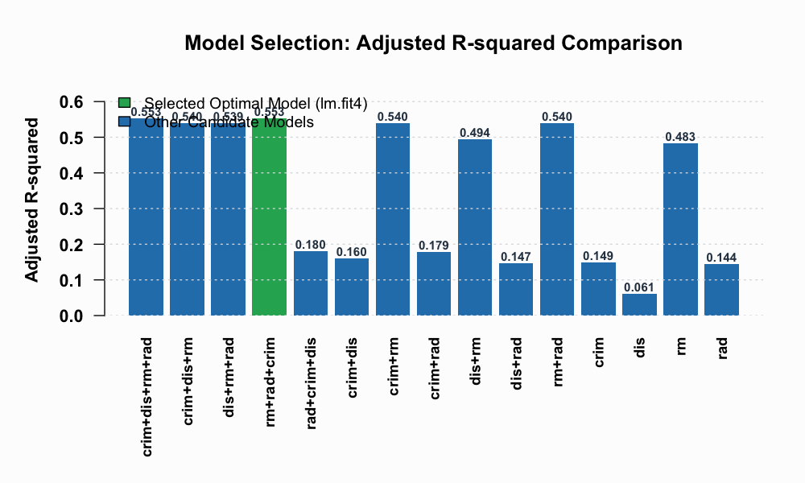
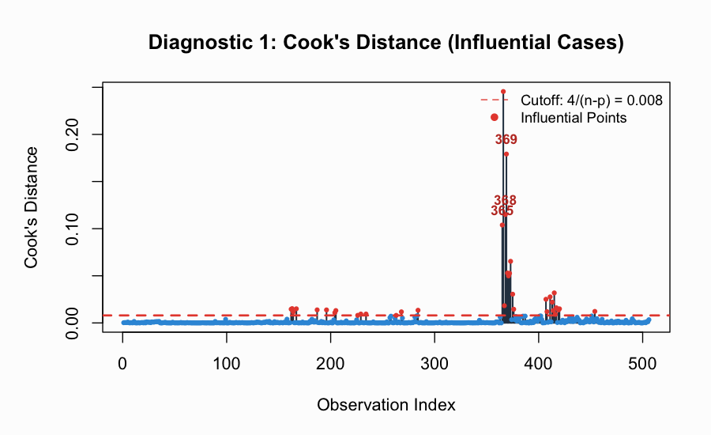
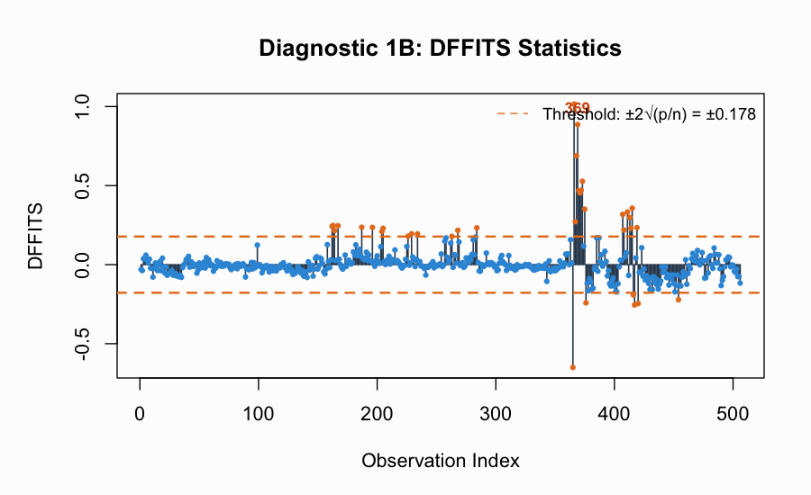
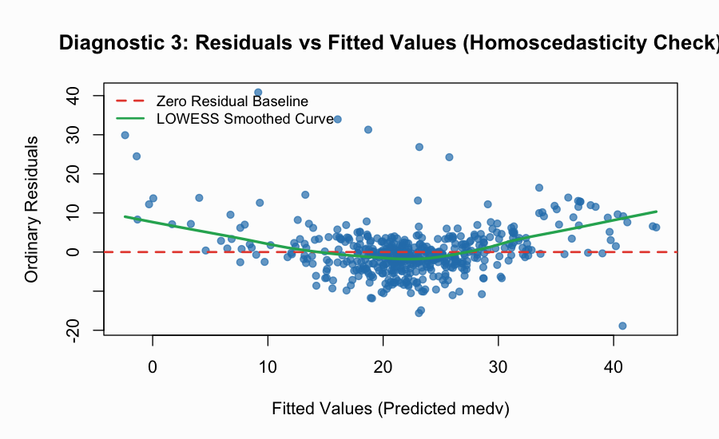
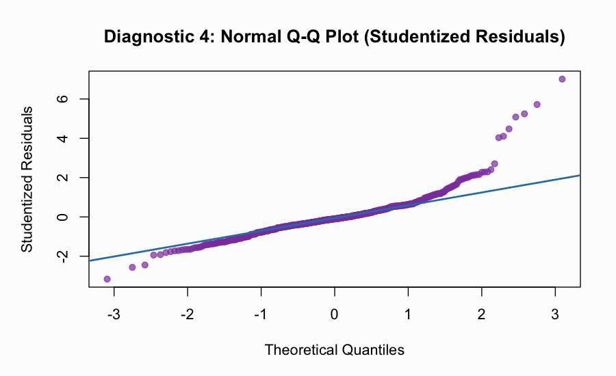
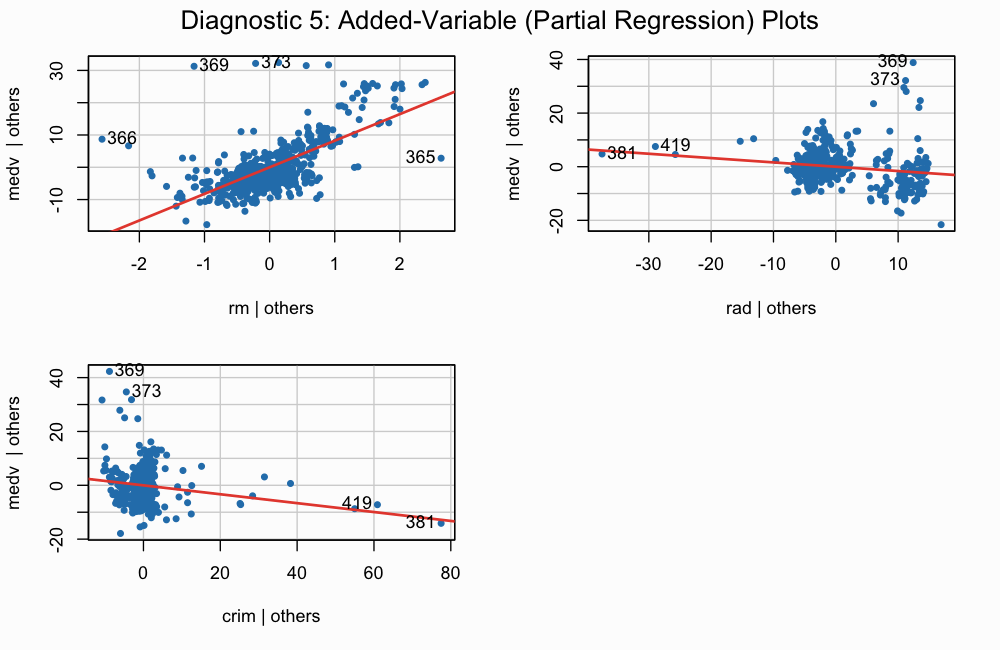
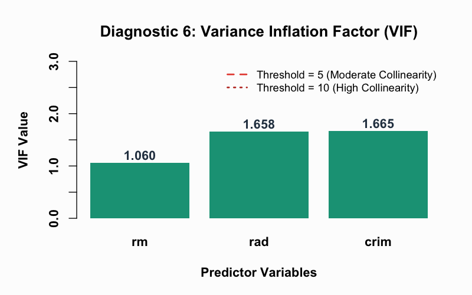

# Statistical Diagnostics and Model Selection in Multiple Linear Regression (MLR)

<div align="center">

[](https://www.r-project.org/)
[](https://opensource.org/licenses/MIT)
[](https://cran.r-project.org/web/packages/ISLR2/index.html)
[](https://github.com/aryan-Kuldeep/Diagonistic-MLR)
[]()

**An in-depth econometric and statistical diagnostic study on the Classical Linear Regression Model (CLRM) assumptions using the Boston Housing Dataset.**

[Key Features](#key-features) • [Model Selection](#model-selection-and-comparison) • [Statistical Diagnostics](#statistical-diagnostics) • [Visualizations](#diagnostic-visualizations) • [Getting Started](#getting-started) • [Remedial Measures](#remedial-strategies--insights)

</div>

---

## Executive Summary

Multiple Linear Regression (MLR) is one of the foundational statistical and econometric techniques for inferring relationships between dependent target metrics and multidimensional explanatory variables. However, the validity of **Ordinary Least Squares (OLS)** estimates—specifically the Gauss-Markov theorem property of **Best Linear Unbiased Estimators (BLUE)**—critically depends upon several fundamental assumptions:

1. **Strict Exogeneity & Zero Mean Errors**: $\mathbb{E}[\varepsilon | X] = 0$
2. **Homoscedasticity**: $\text{Var}(\varepsilon_i | X) = \sigma^2$ (constant variance)
3. **No Autocorrelation**: $\text{Cov}(\varepsilon_i, \varepsilon_j | X) = 0 \quad \forall i \neq j$
4. **Normality of Errors**: $\varepsilon \sim \mathcal{N}(0, \sigma^2 I)$ (critical for exact finite-sample $t$ and $F$ inference)
5. **No Multicollinearity**: $\text{Rank}(X) = p + 1 \leq n$
6. **Absence of Undue Influential Points / High-Leverage Outliers**

This project executes a rigorous **exhaustive subset selection** ($2^4 - 1 = 15$ candidate specifications) on the `Boston` dataset (`ISLR2`), selects the optimal specification based on Adjusted $R^2$, and performs an exhaustive **6-tier diagnostic evaluation** covering Cook's Distance, DFFITS, Durbin-Watson tests, Studentized Q-Q normality checks, Added-Variable partial regression plots, and Variance Inflation Factor (VIF) collinearity metrics.

---

## Dataset Overview

The study utilizes the `Boston` housing dataset available in the [`ISLR2`](https://cran.r-project.org/web/packages/ISLR2/) library, comprising $n = 506$ census tracts around Boston with 14 economic, spatial, and demographic metrics.

* **Response Variable ($Y$)**: 
  * `medv`: Median value of owner-occupied homes in USD 1,000s.
* **Candidate Regressors ($X$)**:
  * `crim`: Per capita crime rate by town.
  * `dis`: Weighted mean of distances to five Boston employment centres.
  * `rm`: Average number of rooms per dwelling.
  * `rad`: Index of accessibility to radial highways.

Data hygiene check confirmed **0 missing values** across all $n = 506$ records.

---

## Mathematical Formulation

### 1. Multiple Linear Regression Model (Matrix Form)
$$Y = X\beta + \varepsilon$$
$$\hat{\beta}_{OLS} = (X^T X)^{-1} X^T Y$$

### 2. Adjusted Coefficient of Determination ($R^2_{adj}$)
$$R^2_{adj} = 1 - \left[ \frac{(1 - R^2)(n - 1)}{n - p - 1} \right] = 1 - \frac{SS_{res} / (n - p - 1)}{SS_{tot} / (n - 1)}$$
where $n = 506$ is the sample size, and $p$ is the number of explanatory regressors (excluding the intercept).

---

## Model Selection and Comparison

All $15$ subset combinations of the 4 candidate predictors were modeled and evaluated based on Adjusted $R^2$:

| Model ID | Specification Formula | Predictor Count ($p$) | Adjusted $R^2$ | Selection Rank |
| :--- | :--- | :---: | :---: | :---: |
| **`lm.fit4`** | `medv ~ rm + rad + crim` | **3** | **0.5534** | **1 (Optimal)** |
| `lm.fit1` | `medv ~ crim + dis + rm + rad` | 4 | 0.5527 | 2 |
| `lm.fit7` | `medv ~ crim + rm` | 2 | 0.5401 | 3 |
| `lm.fit2` | `medv ~ crim + dis + rm` | 3 | 0.5399 | 4 |
| `lm.fit11` | `medv ~ rm + rad` | 2 | 0.5398 | 5 |
| `lm.fit3` | `medv ~ dis + rm + rad` | 3 | 0.5389 | 6 |
| `lm.fit9` | `medv ~ dis + rm` | 2 | 0.4935 | 7 |
| `lm.fit14` | `medv ~ rm` | 1 | 0.4825 | 8 |
| `lm.fit5` | `medv ~ rad + crim + dis` | 3 | 0.1801 | 9 |
| `lm.fit8` | `medv ~ crim + rad` | 2 | 0.1792 | 10 |
| `lm.fit6` | `medv ~ crim + dis` | 2 | 0.1597 | 11 |
| `lm.fit12` | `medv ~ crim` | 1 | 0.1491 | 12 |
| `lm.fit10` | `medv ~ dis + rad` | 2 | 0.1472 | 13 |
| `lm.fit15` | `medv ~ rad` | 1 | 0.1439 | 14 |
| `lm.fit13` | `medv ~ dis` | 1 | 0.0606 | 15 |

<p align="center">
  
</p>

### Selected Model Summary (`lm.fit4`)
$$\widehat{\text{medv}} = -27.1036 + 8.2384(\text{rm}) - 0.1613(\text{rad}) - 0.1655(\text{crim})$$

* **Residual Standard Error**: $6.146$ on $502$ degrees of freedom
* **Multiple $R^2$**: $0.5560$ | **Adjusted $R^2$**: $0.5534$
* **Overall F-Statistic**: $F(3, 502) = 209.6$, $p < 2.2 \times 10^{-16}$ (statistically significant)

#### OLS Coefficient Estimates:
| Parameter | Estimate ($\hat{\beta}_j$) | Std. Error | $t$-statistic | $p$-value | Significance |
| :--- | :---: | :---: | :---: | :---: | :---: |
| **(Intercept)** | $-27.10363$ | $2.60643$ | $-10.399$ | $< 2.0 \times 10^{-16}$ | $* * *$ |
| **`rm`** | $+8.23836$ | $0.40081$ | $+20.554$ | $< 2.0 \times 10^{-16}$ | $* * *$ |
| **`rad`** | $-0.16133$ | $0.04045$ | $-3.989$ | $7.62 \times 10^{-5}$ | $* * *$ |
| **`crim`** | $-0.16549$ | $0.04103$ | $-4.034$ | $6.35 \times 10^{-5}$ | $* * *$ |

---

## Statistical Diagnostics

We subject the chosen specification (`lm.fit4`) to a comprehensive battery of diagnostic procedures.

### 1. Influential Observations & High-Leverage Analysis

An influential observation disproportionately affects the regression slope estimates when excluded.

#### A. Cook's Distance
$$D_i = \frac{\sum_{j=1}^n (\hat{Y}_j - \hat{Y}_{j(i)})^2}{p \cdot s^2} = \frac{r_i^2}{p} \left( \frac{h_{ii}}{1 - h_{ii}} \right)$$
* **Theoretical Threshold**: $D_i > \frac{4}{n - p - 1} = \frac{4}{502} \approx 0.007968$
* **Findings**: Several observations exceed the threshold, with extreme cases identified at tracts **#365, #366 ($D=0.245$), #368 ($D=0.115$), #369 ($D=0.179$), #372, #407, #415**.

<p align="center">
  
</p>

#### B. DFFITS (Difference in Fits)
$$\text{DFFITS}_i = \frac{\hat{Y}_i - \hat{Y}_{i(i)}}{s_{(i)} \sqrt{h_{ii}}} = r_{student, i} \left( \frac{h_{ii}}{1 - h_{ii}} \right)^{1/2}$$
* **Threshold**: $| \text{DFFITS}_i | > 2\sqrt{\frac{p}{n}} \approx 2\sqrt{\frac{4}{506}} \approx 0.177$ (or $\frac{4}{502} \approx 0.00797$).
* **Findings**: Confirms heavy influence on fitted values for tracts in the higher crime/outlying room brackets.

<p align="center">
  
</p>

---

### 2. Autocorrelation & Error Independence

The Classical Linear Model assumes uncorrelated disturbance terms ($\text{Cov}(\varepsilon_i, \varepsilon_j) = 0$).

#### Durbin-Watson Test
$$d = \frac{\sum_{t=2}^n (e_t - e_{t-1})^2}{\sum_{t=1}^n e_t^2}$$

* **Hypothesis Testing**:
  * $H_0: \rho = 0$ (No first-order autocorrelation)
  * $H_1: \rho > 0$ (Positive spatial/serial autocorrelation)
* **Empirical Results**:
  * **$DW = 0.76888$**
  * **$p$-value $< 2.2 \times 10^{-16}$**
* **Inference**: Because $DW \ll 2.0$ with a highly significant $p$-value, **errors exhibit substantial positive autocorrelation**. In the Boston dataset, this is primarily driven by **spatial clustering**: adjacent geographical tracts share unobserved neighborhood amenities and socio-economic externalities.

---

### 3. Homoscedasticity vs. Heteroscedasticity

Constant variance of error terms ($\text{Var}(\varepsilon_i) = \sigma^2$) is required for OLS standard errors to be unbiased.

* **Plot**: Ordinary Residuals vs. Fitted Values ($\hat{Y}_i$) with a LOWESS smoothing curve.
* **Findings**: The residuals display moderate fan-shaped spreading at higher predicted property values ($\hat{Y} > 30$), along with noticeable positive residual spikes at the ceiling ($\text{medv} = 50$).

<p align="center">
  
</p>

---

### 4. Normality of Residuals

Normality is required for exact $t$-tests and $F$-tests in finite samples.

#### Shapiro-Wilk Test & Studentized Q-Q Plot
* **Shapiro-Wilk Statistic**: $W = 0.86384, \quad p\text{-value} < 2.2 \times 10^{-16}$
* **Findings**: Rejection of the null hypothesis of normality. The Studentized Q-Q plot exhibits a heavy right tail (positive skewness), attributable to top-coded properties at $\$50,000$.

<p align="center">
  
</p>

---

### 5. Linearity Assumption (Partial Regression / Added-Variable Plots)

Added-Variable Plots ($e(Y | X_{-j})$ vs. $e(X_j | X_{-j})$) isolate the marginal effect of each explanatory variable while controlling for all others.

* **`rm`**: Strong positive linear slope ($\hat{\beta} = +8.238$, $t = 20.55$).
* **`rad`**: Definite negative slope ($\hat{\beta} = -0.161$, $t = -3.99$).
* **`crim`**: Definite negative slope ($\hat{\beta} = -0.165$, $t = -4.03$).
* **Conclusion**: Linearity holds well across each individual regressor dimension.

<p align="center">
  
</p>

---

### 6. Multicollinearity Diagnostics

Multicollinearity inflates the variance of estimated regression coefficients, degrading statistical power and interpretability.

#### Variance Inflation Factor (VIF)
$$\text{VIF}_j = \frac{1}{1 - R_j^2}$$
where $R_j^2$ is the coefficient of determination when $X_j$ is regressed on all remaining explanatory variables.

| Variable ($X_j$) | Variance Inflation Factor (VIF) | Threshold (< 5.0) | Status |
| :--- | :---: | :---: | :---: |
| **`rm`** | **$1.0602$** | Safe | Collinearity Not Present |
| **`rad`** | **$1.6579$** | Safe | Collinearity Not Present |
| **`crim`** | **$1.6649$** | Safe | Collinearity Not Present |

<p align="center">
  
</p>

* **Inference**: All VIF values are substantially below conservative thresholds ($VIF < 5.0$), demonstrating **orthogonal/independent explanatory power** without harmful variance inflation.

---

## Remedial Strategies & Insights

Based on our empirical diagnostic findings, the following statistical remedies enhance model robustness:

1. **Log-Transformation of Target ($\log(\text{medv})$)**: Mitigates right-skewness in residuals and stabilizes heteroscedastic variance across fitted ranges.
2. **Spatial Autoregressive (SAR) Modeling**: Incorporates spatial weight matrices ($W$) to directly account for spatial error autocorrelation identified by the Durbin-Watson statistic ($DW = 0.769$).
3. **Robust Regression / Huber-White Sandwich Estimators**: Uses HC3/HC4 heteroscedasticity-consistent standard errors and M-estimation (Huber weighting) to down-weight high-leverage Cook's distance outliers.

---

## Project Structure

```text
Diagonistic-MLR/
├── Diagnostic.R          # Primary R script containing model fitting & diagnostic tests
├── generate_plots.R      # Automated plotting script generating high-res figures
├── figures/              # Publication-ready diagnostic charts (PNG)
│   ├── model_comparison.png
│   ├── cooks_distance.png
│   ├── dffits.png
│   ├── residuals_vs_fitted.png
│   ├── qq_plot.png
│   ├── av_plots.png
│   └── vif_barplot.png
├── .gitignore            # Git exclusion rules for R workspace artifacts
├── LICENSE               # Open-source MIT License
└── README.md             # Comprehensive project documentation
```

---

## Getting Started

### Prerequisites
Ensure you have **R (>= 4.0.0)** installed on your machine.

### Required Packages
Install the necessary R packages via CRAN:
```R
install.packages(c("ISLR2", "DescTools", "car", "mctest"))
```

### Execution
Clone the repository and run the scripts:

```bash
# Clone the repository
git clone https://github.com/aryan-Kuldeep/Diagonistic-MLR.git
cd Diagonistic-MLR

# Execute the primary diagnostics script
Rscript Diagnostic.R

# Generate all visual diagnostic plots
Rscript generate_plots.R
```

---

## License

This project is licensed under the [MIT License](LICENSE) - see the LICENSE file for details.

---

<div align="center">
  <sub>Developed by <b>Aryan Kuldeep</b> • Indian Institute of Technology (IIT) Jodhpur</sub>
</div>
